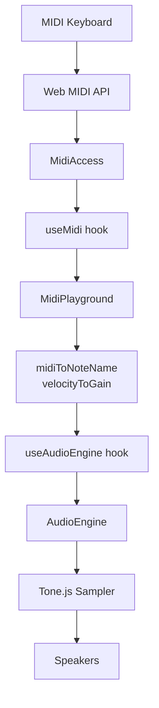

# Cortina — Musical Training with MIDI

A web-based musical training app that connects to MIDI keyboards via the Web MIDI API and plays real piano sounds using Tone.js. Built to help musicians practice intervals, chords, scales, and more — with instant audio feedback from their own MIDI hardware.

> **Status:** Foundation complete. MIDI input capture and piano audio playback are working. Training exercises and UI to be built next.

## Getting Started

```bash
npm install
npm run dev        # Start dev server at http://localhost:3000
npm test           # Run all tests (84 tests, 6 suites)
npm run test:watch # Run tests in watch mode
npm run build      # Production build
npm run lint       # ESLint
```

**Requirements:** A browser that supports the [Web MIDI API](https://developer.mozilla.org/en-US/docs/Web/API/Web_MIDI_API) (Chrome, Edge, Opera). Safari is not supported. Must be served over HTTPS or localhost.

## Project Goals

Cortina is a musical training tool with these guiding principles:

1. **Modular architecture** — each concern lives in its own module with a clear API boundary. Tone.js never leaks outside `lib/audio/`, Web MIDI never leaks outside `lib/midi/`.
2. **Well-tested** — every module has unit tests. Prefer Jest + React Testing Library. Tests should be fast and not require browser or audio hardware.
3. **Progressive enhancement** — the app should gracefully handle browsers without MIDI support, denied permissions, and no connected devices.
4. **Real instrument sounds** — we use Salamander Grand Piano samples (via Tone.js Sampler), not synthesized tones.

## Architecture

```
┌─────────────────────────────────────────────────┐
│  app/components/MidiPlayground.tsx  (UI)         │
│    ↓ uses hooks                                  │
├──────────────────┬──────────────────────────────┤
│  hooks/useMidi   │  hooks/useAudioEngine         │
│  (React bridge)  │  (React bridge)               │
├──────────────────┼──────────────────────────────┤
│  lib/midi/       │  lib/audio/                   │
│  MidiAccess      │  AudioEngine                  │
│  (Web MIDI API)  │  (Tone.js Sampler)            │
├──────────────────┴──────────────────────────────┤
│  lib/music/midi.ts                               │
│  Pure utility functions (note names, velocity)   │
└─────────────────────────────────────────────────┘
```

### Directory Structure

```
app/                    # Next.js App Router pages and components
  components/           # Client components (UI layer)
hooks/                  # React hooks — thin bridges between lib/ and components
lib/
  music/                # Pure functions — music theory, no side effects
  midi/                 # Web MIDI API wrapper — sole MIDI gateway
  audio/                # Tone.js wrapper — sole audio consumer
```

Tests live in `__tests__/` directories colocated with their source files. Jest config and global mocks are at the project root (`jest.config.ts`, `jest.setup.ts`).

### Module Responsibilities

| Module                     | What it does                                                         | What it does NOT do                            |
| -------------------------- | -------------------------------------------------------------------- | ---------------------------------------------- |
| `lib/music/midi.ts`        | Converts MIDI numbers to note names, velocity to gain                | No side effects, no imports from other modules |
| `lib/midi/MidiAccess.ts`   | Wraps Web MIDI API, parses MIDI messages, manages device connections | Never touches audio, never imports Tone.js     |
| `lib/audio/AudioEngine.ts` | Manages Tone.js Sampler, handles note on/off playback                | Never touches MIDI, sole consumer of Tone.js   |
| `hooks/useMidi.ts`         | React state management for MIDI access, devices, events              | No audio, no Tone.js                           |
| `hooks/useAudioEngine.ts`  | React state management for audio engine lifecycle                    | No MIDI, no DOM                                |
| `MidiPlayground.tsx`       | Wires hooks together, renders UI, handles user gestures              | No direct access to Web MIDI or Tone.js APIs   |

### Data Flow



## Key Decisions

### Testing: Jest over Vitest

We chose **Jest 30 + React Testing Library** for testing. Jest integrates well with `next/jest` for SWC transforms. Tone.js is mocked globally in `jest.setup.ts` to avoid ESM transform issues — the `transformIgnorePatterns` config alone wasn't sufficient.

### Audio: Tone.js Sampler with Salamander Grand Piano

We started with `Tone.PolySynth` but switched to `Tone.Sampler` with **Salamander Grand Piano** samples for realistic sound. Samples are loaded from `https://tonejs.github.io/audio/salamander/` by default. The `AudioEngine` constructor accepts a `baseUrl` option for self-hosting samples.

~25 sample files cover the full 88-key range (every ~3 semitones); Tone.Sampler pitch-shifts to fill gaps.

### Web MIDI Types: Native TypeScript

We initially created custom type definitions in `types/webmidi.d.ts` but discovered TypeScript's built-in `lib.dom.d.ts` already includes complete Web MIDI API types. The custom file was removed — no `@types/*` package needed.

### MIDI Message Parsing

- Status byte upper nibble = command (0x90 = Note On, 0x80 = Note Off)
- Status byte lower nibble = channel (0-15)
- Note On with velocity 0 is treated as Note Off (common MIDI convention)
- Messages with fewer than 3 bytes are ignored

### Audio Initialization

`AudioEngine.init()` must be called from a user gesture handler (browser AudioContext policy). The UI shows an "Enable Audio" button that triggers this. During sample loading, the button shows "Loading piano samples..." and is disabled.

## Testing Patterns

**Tone.js is mocked globally** in `jest.setup.ts`. Never import Tone.js in tests directly — the mock provides `Tone.Sampler`, `Tone.start`, `Tone.loaded`, and `Tone.now`.

**Web MIDI API** is mocked per-test using `MockMIDIInput` and `MockMIDIAccess` classes in `MidiAccess.test.ts`.

**React hooks** are tested with `renderHook` + `waitFor` from `@testing-library/react`. State updates from async MIDI callbacks should be wrapped in `act()`.

**Component tests** mock the hooks (`useMidi`, `useAudioEngine`) entirely — they don't test real MIDI or audio, just UI rendering and event wiring.

## Adding New Features

When adding training exercises or new UI:

1. **Pure logic** goes in `lib/` — keep it framework-free and testable
2. **React state bridges** go in `hooks/` — keep them thin wrappers
3. **UI** goes in `app/components/` — compose from hooks
4. **Never import Tone.js outside `lib/audio/`** — this is a hard boundary
5. **Never import Web MIDI types/code outside `lib/midi/`** — also a hard boundary
6. Write tests alongside every new module

## Tech Stack

| Technology            | Version | Purpose                                                           |
| --------------------- | ------- | ----------------------------------------------------------------- |
| Next.js               | 16.1.6  | App Router, React framework                                       |
| React                 | 19.2.3  | UI library                                                        |
| TypeScript            | 5.x     | Type safety, strict mode                                          |
| Tone.js               | 15.1.22 | Audio synthesis and sampling                                      |
| Tailwind CSS          | 4.x     | Utility-first styling (CSS-based config, no `tailwind.config.js`) |
| Jest                  | 30.2.0  | Test runner                                                       |
| React Testing Library | 16.3.2  | Component testing                                                 |
| `next/jest`           | —       | SWC transforms for Jest                                           |
